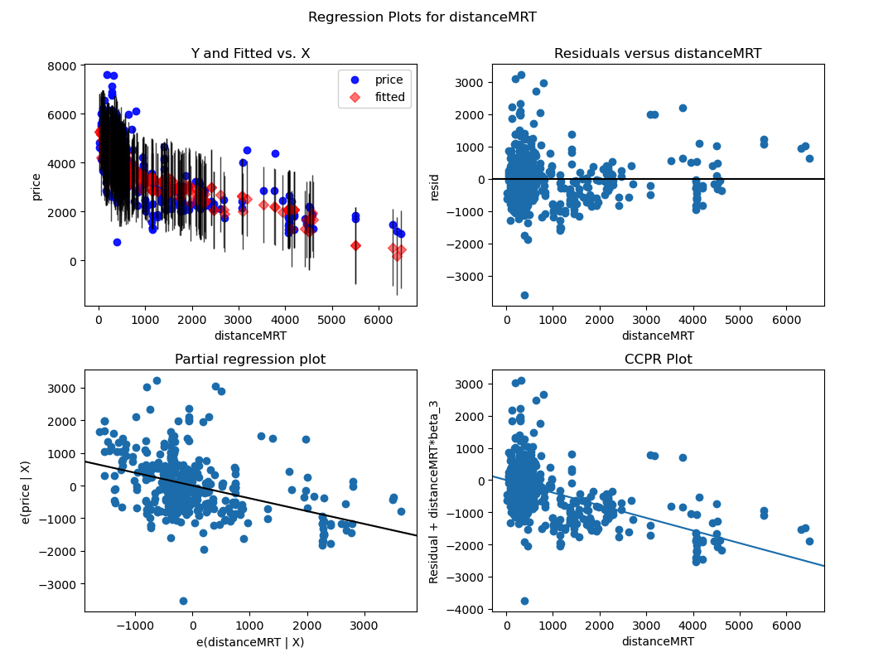
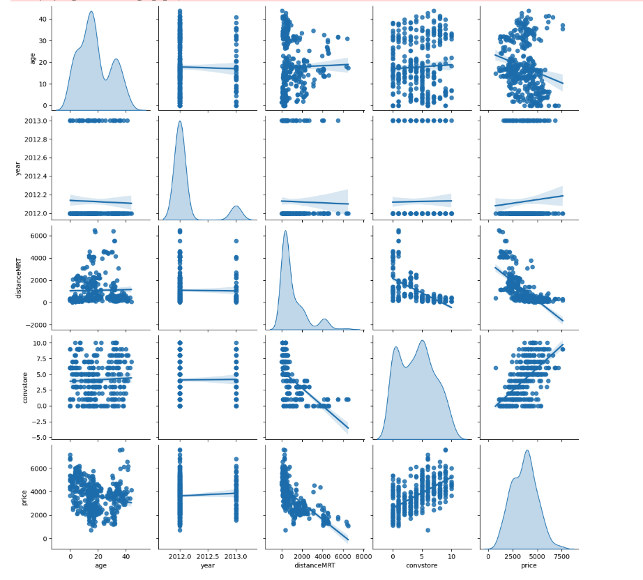
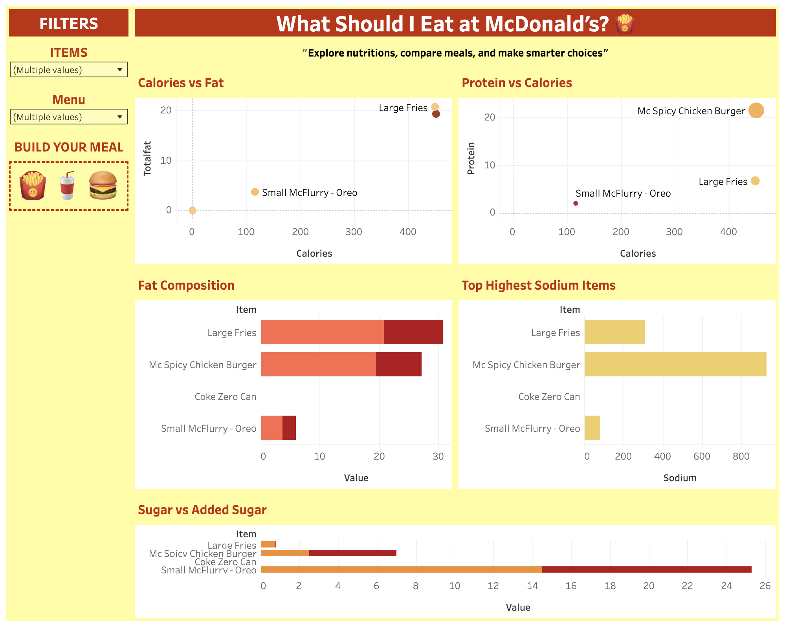
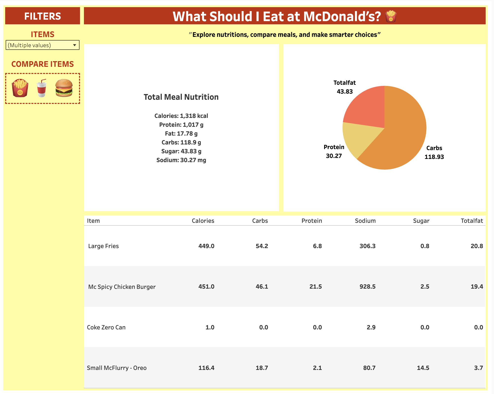
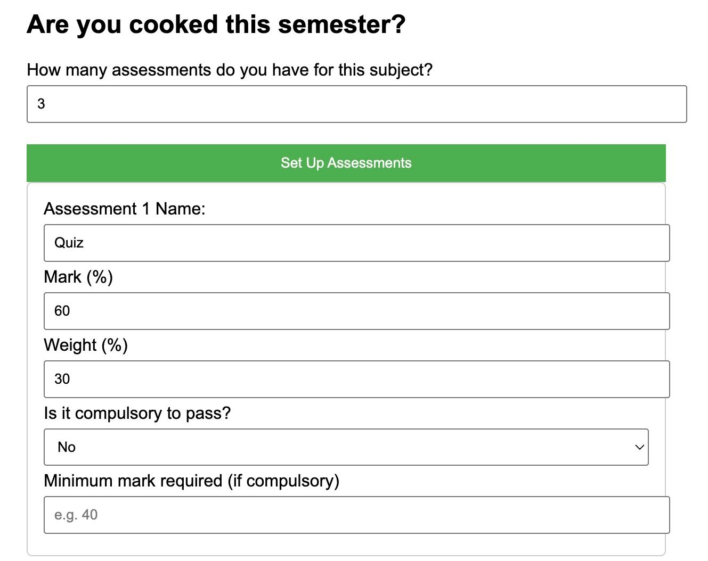
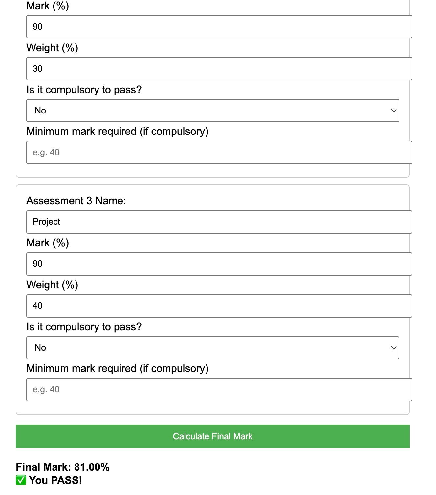

# 📑 Projects

## 1. Real Estate Valuation Analysis [Python • StatsModels] 🏠

🔗 [View Project](https://github.com/hien-linda-le/real-estate-analysis.git)

✍️ Description: A full statistical analysis exploring how structural and locational factors influence housing prices in a Taiwan city. This project uses Python, Pandas, StatsModels, and Seaborn to uncover linear, interaction-based, and nonlinear effects behind real estate valuation.

**Correlation & Exploratory Analysis:** Conducted EDA to understand variable relationships. Key findings include:

- Strong negative correlation between distance to MRT and price.

- Positive association between nearby convenience stores and higher prices.

- Older homes tend to be priced lower.

**Regression Modeling:** Developed multiple OLS regression models to compare predictive performance and interpret effects:

- Simple Linear Regression: price ~ distanceMRT

- Multiple Regression: price ~ age + convstore + year

- Interaction Model: distanceMRT × convstore

- Polynomial Model: non-linear distance effects using squared and cubic terms.
  Included diagnostic checks for heteroskedasticity, multicollinearity, and residual distribution.

**Key Insights:**

- Homes closer to MRT stations consistently hold higher value.

- Convenience store count amplifies pricing, potentially capturing neighbourhood accessibility.

- Interaction effects show MRT distance matters more in areas with fewer stores.

- Polynomial modeling reveals pricing declines with MRT distance at a non-linear rate.

🔎 Showcases skills in statistical reasoning, data preprocessing, OLS modeling, interaction term analysis, model diagnostics, and interpreting real-world economic relationships.

---

## 2. McDonald’s Menu Nutrition Explorer [Tableau] 🍔

🔗  [View Project](https://public.tableau.com/app/profile/linda.le7580/viz/mcdonald_nutrition/Dashboard1?publish=yes)  

✍️ Description: Tableau dashboards designed to help users compare McDonald’s menu items across calories, fat, sugar, sodium, and serving size. Includes interactive filters for meal type and nutrition categories, making it easier to choose healthier or preferred meal options.
  
- **Comparative Nutritions:** Show analysis across key nutritional metrics, including Calories vs. Fat, Protein vs. Calories, Fat Composition, Sodium levels, and Sugar content.
  
  

- **Meal Builder:** Provides a detailed analysis comparing the individual nutritional values of a selected meal.
  
  

🔎 Demonstrates skills in data preparation, interactive dashboard design, and visual storytelling to support informed decision-making.

---

## 3. Are You Cooked This Semester? [HTML • CSS • JavaScript] 💯

🔗 [View Project]([Link](https://hien-linda-le.github.io/exam_calculator/))  

✍️ Description: A fun, interactive web calculator that helps students determine their final subject mark based on assessment scores, weightings, and compulsory pass requirements. The tool dynamically generates input fields, calculates weighted totals, checks threshold conditions, and provides an instant pass/fail verdict.
  
- **Dynamic Assessment Builder:** Users enter the number of assessments, and the form automatically generates customizable fields for assessment name, mark, weight, compulsory status, and required thresholds.
  
  

- **Final Mark & Pass/Fail Calculator:** Calculates the weighted final grade, identifies whether compulsory assessments meet minimum requirements, and displays clear pass/fail results with explanations.
  
  

🔎 Demonstrates skills in DOM manipulation, client-side logic, dynamic UI creation, and user-centric interactive tool design.

---

# 📝 About Me

## 💼 Experience

### PwC, Australia  
**Analyst** (March 2025 – Present)  
- Ensured data accuracy and compliance through robust validation processes, maintaining 100% audit readiness within high-volume KYC operations.
- Streamlined data collection and verification workflows, reducing issue resolution time by 25%.
- Improved data accuracy and turnaround time by optimising document verification workflows using Excel automation and data validation checks.
- Utilised multiple data management systems (CRM, ALLFI, HOGAN, ) to extract, verify, and reconcile customer information efficiently.

### Australian Menopause Centre, Australia  
**Business Analyst & Data Analyst Intern** (July 2024 – December 2024)  
- Reduced manual reporting time by 30% by designing and maintaining interactive Power BI KPI dashboards that streamlined data access for senior management.
- Leveraged the company’s CRM system to extract, clean, and integrate patient health, marketing, and operational data for comprehensive analysis.
- Analysed complex datasets to identify growth opportunities and improve decision-making across departments.
- Delivered accurate forecasting models and insights that informed strategic planning and budget allocation, directly supporting business growth projections.
- Improved data management efficiency through workflow automation and best-practice documentation, strengthening the organisation’s analytics and CRM integration capabilities.

---

## 🎓 Education

- **Bachelor of Data Science (minor in Cybersecurity Systems)**, Western Sydney University (March 2024 – December 2025)

- **Bachelor of Computer Science (major in Artificial Intelligence)**, Western Sydney University (March 2022 – December 2023) 

---

## 🛠️ Technical Skills

- **Data Visualisation**: Tableau, Power BI  
- **Data Management**: SQL, R, Python 
- **Productivity Tools**: Excel, Microsoft Office  
- **Methodologies**: Agile  

---

## 🌐 Languages

- Vietnamese (Native)
- English (Intermediate)  

---

## 📜 Certifications

- Web Analytics & Digital Marketing Analytics - Udemy (2025)
- Career Essentials in Data Analysis - Microsoft & LinkedIn (2024)

