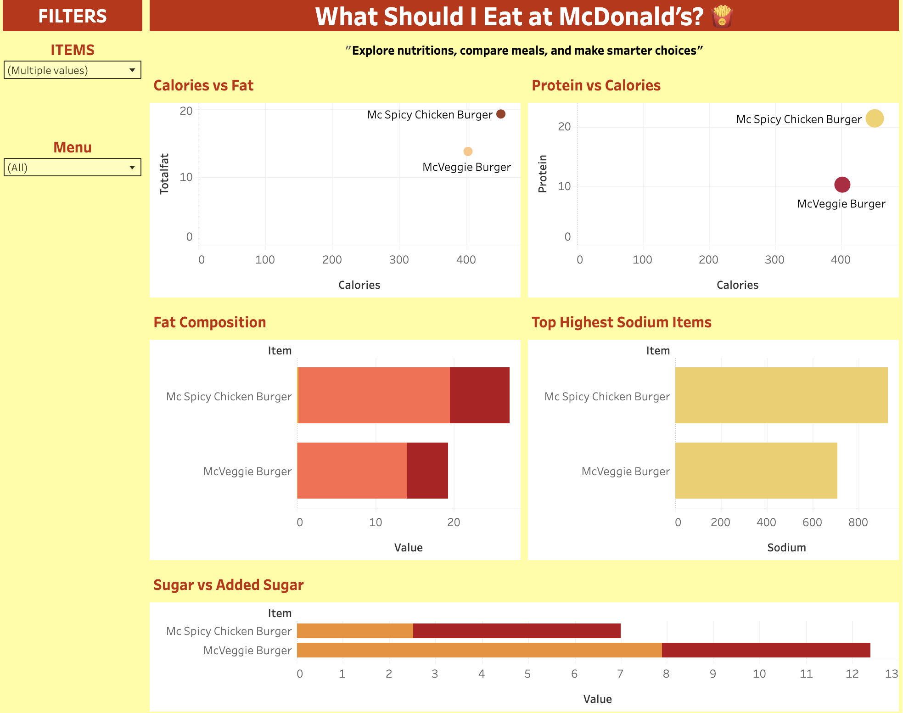

# Projects

## 1. McDonald’s Menu Nutrition Explorer [Tableau]  
🔗 [View Project](https://public.tableau.com/app/profile/linda.le7580/viz/mcdonald_nutrition/Dashboard1?publish=yes)  

✍️ Description
- **Dashboard:** A Tableau dashboard designed to help users compare McDonald’s menu items across calories, fat, sugar, sodium, and serving size. Includes interactive filters for meal type and nutrition categories, making it easier to choose healthier or preferred meal options.
  
  

🔎 Demonstrates skills in data preparation, interactive dashboard design, and visual storytelling to support informed decision-making.

---

## 2. Title [Tableau]  
🔗 [View Project](Link)  

✍️ Description
- **Dashboard:** What it does
  
  

- **Dashboard:** What it does
  
  

🔎 Demonstrates skills in data preparation, interactive dashboard design, and visual storytelling to support business decision‑making.

---

## 3. Title [Tableau]  
🔗 [View Project](Link)  

✍️ Description
- **Dashboard:** What it does
  
  

- **Dashboard:** What it does
  
  

🔎 Demonstrates skills in data preparation, interactive dashboard design, and visual storytelling to support business decision‑making.

---

## 4. Title [Tableau]  
🔗 [View Project](Link)  

✍️ Description
- **Dashboard:** What it does
  
  

- **Dashboard:** What it does
  
  

🔎 Demonstrates skills in data preparation, interactive dashboard design, and visual storytelling to support business decision‑making.

---

# 📝 About Me

## 💼 Experience

### PwC, Australia  
**Analyst** (March 2025 – Present)  
- Ensured data accuracy and compliance through robust validation processes, maintaining 100% audit readiness within high-volume KYC operations.
- Streamlined data collection and verification workflows, reducing issue resolution time by 25%.
- Improved data accuracy and turnaround time by optimising document verification workflows using Excel automation and data validation checks.
- Utilised multiple data management systems (CRM, ALLFI, HOGAN, ) to extract, verify, and reconcile customer information efficiently.

### Australian Menopause Centre, Australia  
**Business Analyst & Data Analyst Intern** (July 2024 – December 2024)  
- Reduced manual reporting time by 30% by designing and maintaining interactive Power BI KPI dashboards that streamlined data access for senior management.
- Leveraged the company’s CRM system to extract, clean, and integrate patient health, marketing, and operational data for comprehensive analysis.
- Analysed complex datasets to identify growth opportunities and improve decision-making across departments.
- Delivered accurate forecasting models and insights that informed strategic planning and budget allocation, directly supporting business growth projections.
- Improved data management efficiency through workflow automation and best-practice documentation, strengthening the organisation’s analytics and CRM integration capabilities.

---

## 🎓 Education

- **Bachelor of Data Science**, Western Sydney University (March 2024 – December 2025)  
- **Bachelor of Computer Science**, Western Sydney University (March 2022 – December 2023) 

---

## 🛠️ Technical Skills

- **Data Visualisation**: Tableau, Power BI  
- **Data Management**: SQL, R, Python 
- **Productivity Tools**: Excel, Microsoft Office  
- **Methodologies**: Agile  

---

## 🌐 Languages

- Vietnamese (Native)
- English (Intermediate)  

---

## 📜 Certifications

- Web Analytics & Digital Marketing Analytics - Udemy (2025)
- Career Essentials in Data Analysis - Microsoft & LinkedIn (2024)

